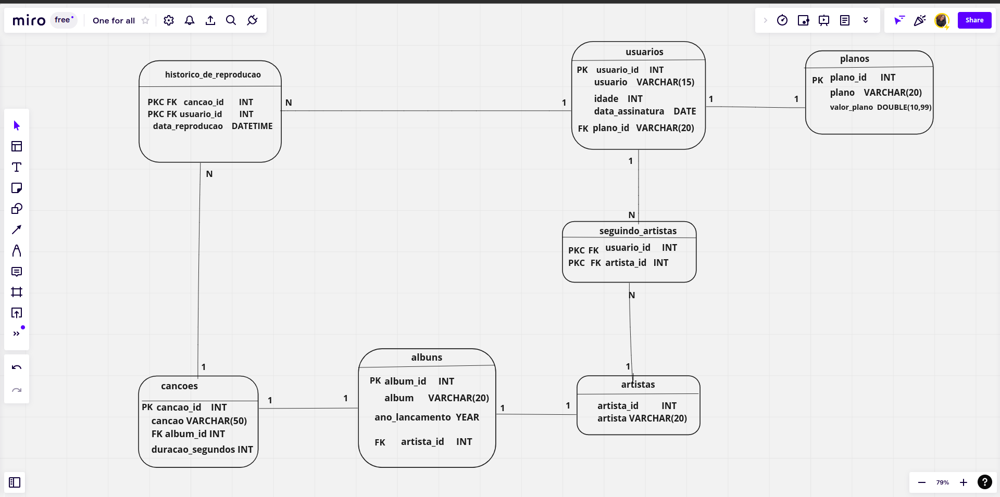

## Desenvolvimento

Normalizei uma tabela na terceira forma normal e acessei as informações desta tabela através de `queries` utilizando `SQL`.

<details>
  <summary><strong>:whale: Rodando no Docker vs Localmente</strong></summary><br />
  
  ## Com Docker
 
  > Rode os serviços `node` e `db` com o comando `docker-compose up -d`.
  - Lembre-se de parar o `mysql` se estiver usando localmente na porta padrão (`3306`), ou adapte, caso queria fazer uso da aplicação em containers
  - Esses serviços irão inicializar um container chamado `one_for_all` e outro chamado `one_for_all_db`.
  - A partir daqui você pode rodar o container `one_for_all` via CLI ou abri-lo no VS Code.

  > Use o comando `docker exec -it one_for_all bash`.
  - Ele te dará acesso ao terminal interativo do container criado pelo compose, que está rodando em segundo plano;
  - As credencias de acesso ao banco de dados estão definidas no arquivo `docker-compose.yml`, e são acessíveis no container através das variáveis de ambiente `MYSQL_USER` e `MYSQL_PASSWORD`. 💡

  > Instale as dependências [**Caso existam**] com `npm install`
  
  ⚠ Atenção ⚠ Caso opte por utilizar o Docker, **TODOS** os comandos disponíveis no `package.json` (npm start, npm test, npm run dev, ...) devem ser executados **DENTRO** do container, ou seja, no terminal que aparece após a execução do comando `docker exec` citado acima. 

  ⚠ Atenção ⚠ O **git** dentro do container não vem configurado com suas credenciais. Ou faça os commits fora do container, ou configure as suas credenciais do git dentro do container.

  ⚠ Atenção ⚠ Não rode o comando npm audit fix! Ele atualiza várias dependências do projeto, e essa atualização gera conflitos com o avaliador.


✨ **Dica:** A extensão `Remote - Containers` (que estará na seção de extensões recomendadas do VS Code) é indicada para que você possa desenvolver sua aplicação no container Docker direto no VS Code, como você faz com seus arquivos locais.


 :warning: Atenção :warning: Para que você consiga rodar o seu projeto com docker e o avaliador funcione é fundamental que o seu docker compose esteja na **versão 1.29** 
 primeiro verifique sua versão 
 > docker-compose --version

 Se não for a versão 1.29, faça os seguintes comandos para atualizar a versão:
 
 >sudo rm /usr/local/bin/docker-compose

 >sudo curl -L "https://github.com/docker/compose/releases/download/1.29.0/docker-compose-$(uname -s)-$(uname -m)" -o /usr/local/bin/docker-compose

 >sudo chmod +x /usr/local/bin/docker-compose


---
  
  ## Sem Docker
  
  
  > Instale as dependências [**Caso existam**] com `npm install`
  
  ⚠ Atenção ⚠ Não rode o comando npm audit fix! Ele atualiza várias dependências do projeto, e essa atualização gera conflitos com o avaliador.

  ✨ **Dica:** Para rodar o projeto desta forma, obrigatoriamente você deve ter o `node` instalado em seu computador.
  ✨ **Dica:** O avaliador espera que a versão do `node` utilizada seja a 16.

  <br/>

  ⚠️ **Dica**: Caso queira utilizar _Docker_ para rodar os testes localmente, basta executar o comando: Deletei os testes pois eram da trybe ⚠️

```sh
docker run -p 3306:3306 --name mysql_57 -e MYSQL_ROOT_PASSWORD=1234 -d mysql:5.7 mysqld --default-authentication-plugin=mysql_native_password
```

<details close>
  <summary>O que está sendo feito</summary>
  <br>
   > :point_right: ideia geral:
  - Baixa e executa uma imagem _docker_ do MySQL na versão 5.7.

  > :point_right: flag --name:
  - Define um nome para o nosso _container_: "meu-mysql-5_7".

  > :point_right: flag -e:
  - Define a variável de ambiente "MYSQL_ROOT_PASSWORD" com o valor "1234".

  > :point_right: flag -d:
  - Define que o container rode em segundo plano.

  > :point_right: flag -p:
  - Mapeia uma porta local a uma porta do _container_.

  > :point_right: mysql:5.7:
  - Define qual versão da imagem  mySQL queremos, no caso, a 5.7, que é a esperada pelo avaliador.
</details>


Utilizando o comando acima, para executar os testes localmente basta digitar no terminal:

```sh
MYSQL_USER=root MYSQL_PASSWORD=1234 HOSTNAME=localhost npm test
```
</details>


<details>
  <summary><strong>🎯 Problema a ser resolvido</strong></summary><br />

## Normalizei as tabelas para a 3ª Forma Normal


[Faça o download dela aqui](./SpotifyClone-Non-NormalizedTable.xlsx)
Como o VS Code não oferece suporte para abrir planilhas, você precisa ter alguma software de especifico para isso, aqui deixamos algumas sugestões:
- [LibreOffice Calc](https://www.libreoffice.org/download/download/) para distros Linux;
- [Numbers](https://www.apple.com/br/numbers/) Mac OS;
- Google planilhas para utilizar no browser;
-  Extensão para o VS Code como a Excel Viewer;

> Obs. Em alguns SOs já costuma vir instalado algum programa para manipular planilhas.
</details>

### Diagrama da tabela normalizada
